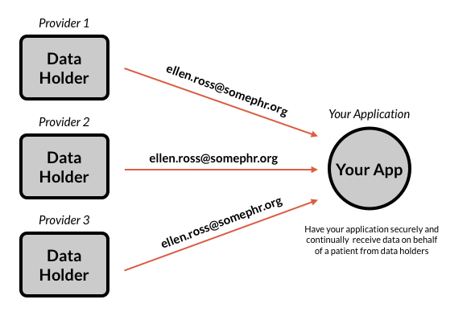

# Receiving Health Data Using the Direct Protocol

This section describes the use of the [Direct Project](http://directproject.org) specification to receive health data securely from a data holder on behalf of a patient or their authorized representative. The ability to receive health data securely enables an ecosystem to be built on patient health data.

## 1. Using the Direct Protocol to Receive Data
The Direct Protocol is a specification for how existing standards can be used to securely transport health information over the Internet. Direct uses SMTP, S/MIME, and X.509 certificates to achieve security, privacy, data integrity, authentication of sender and receiver, and confirmation of delivery.

Your application will need to integrate with a component that can accept Direct messages and their payloads. This component is called a Security/Trust Agent (STA). A STA uses SMTP and S/MIME to ensure messages and their payload are delivered securely. A STA can be a component internal to your system, or hosted externally. 

When an STA is hosted externally, it is usually by a Health Information Services Provider (HISP). 

For Blue Button, your Direct STA/HISP must be able to:

- ***Generate valid Direct addresses*** for your users / use cases.
- ***Publish certificates*** for its addresses via DNSSEC. If the addresses are patient-controlled, you must assign an ***individual certificate*** to each.
- ***Handle errors*** according to the applicability statement.

Your application must be able to:

- ***Receive decrypted/validated messages*** from the HISP component via its native interface. This interface with vary from component to component.
- ***Be able to parse and represent the Blue Button information*** in a method appropriate for your users / use cases. 

See [Direct Protocol Documentation](http://wiki.directproject.org/Documentation+Library), [.NET Reference Implementation](http://wiki.directproject.org/CSharp+Reference+Implementation), and [Java Reference Implementation](http://wiki.directproject.org/Java+Reference+Implementation).

## 2. Blue Button Format and Payload

Once your application has received the message and payload, it needs to process it. It needs to understand what files have been included. It also needs to handle cases where it receives multiple updates from the same user, over a period of time.

As with all Direct messages, Blue Button messages that your application receives from the HISP component will be Internet-format Messages following RFC 5322 and Multipart MIME. Blue Button provides additional guidance on the contents of these messages to support a higher level of semantic exchange.

Blue Button messages will contain:

- ***A human-readable message body.*** This body may be in text/plain or text/html format, or (as is common in many mail systems) both of these. The content of the body is up to the sending application, except that it will always begin with the text “This message was sent by *Data Holder Name* at the request of *Patient Name*.” This tag is intended to clarify the context under which information delivery was authorized.

- ***A clinical summary*** containing a snapshot of the patient or member’s health history. The summary will be a [Consolidated CDA w. Meaningful Use Stage 2 Sections and Fields](healthrecords.html). This section can be recognized by its MIME type, application/xml+ccd.

- ***Optional additional documents.*** These may include any relevant documents, images, or healthcare-specific items such as Transition of Care / Referral Summaries, Ambulatory Summaries or Inpatient Summaries. Below is a table that lists common MIME types for these formats, but the list is not meant to be exhaustive. 

- A ***Request.txt*** that captures the context of the message in a semi-structured way.

### Table of MIME Types

<table>
	<tr>
		<th class="table-column">Document</th>
		<th class="table-column">MIME Type</th>
	</tr>
	<tr>
		<th>Transition of Care Summary</th>
		<td>application/xml</td>
	</tr>
	<tr class="odd">
		<th>Ambulatory Summary</th>
		<td>application/xml</td>
	</tr>
	<tr>
		<th>Inpatient Summary</th>
		<td>application/xml</td>
	</tr>
	<tr class="odd">
		<th>JPEG Image</th>
		<td>image/jpeg</td>
	</tr>
	<tr>
		<th>...</th>
		<td>...</td>
	</tr>
</table>

### Anatomy of Request.txt
In addition to the friendly message in the body, you may receive a ***request.txt***. This is a simple way, much like [robots.txt](http://www.robotstxt.org/robotstxt.html) works to provide some semi-structured context to machines.


Destination: [Direct Address]
Patient: [Patient Name]
Data-holder: [Data Holder Name]
Recurring: [Yes / No]


An example of what a request.txt would look like:


Destination: ellen.ross@somephr.org
Patient: Ellen Ross
Data-holder: Ashby Medical Center
Recurring: Yes


## 3. Frequency
For a given address, there is the likelihood that your application will receive multiple documents over a period of time. This will be especially so, if the consumer sets up an "automated" transmission when ever their health data changes. 

This is beneficial for your application, because it will be getting an up-to-date stream of data. However, your application may need to handle the merging of these transmissions. The means of this merge is up to you as the receiver and not part of Blue Button guidelines.

<!--

### C. Ensuring Validity
To ensure you are receiving from semi-trusted parties, you should verify that the message has been signed by a level 1 or better certificate. You may not want to trust self-signed certificates.

You should also consider rejecting messages to addresses not in your system.
-->
<!--

You need to setup a HISP.
You need to make your certificate publicly accessible.
You need to register with a "whitelist" provider.
You need to then give addresses to your users.
Now when you receive messages to those addresses, you do something special with it on-behalf of your user.
Your system will know what type of file it is by doing ZZZ.

If the consumer has setup "automation", expect to receive messages continually. Your system needs to handle this case.

If you receive a message that is directed to an unknown address, reject it.

## Privacy & Security

What privacy and security guidance do we need to provide?

## FAQ

1. How do I get a certificate for my application?
2. How do I get listed in the trusted whitelist?

-->