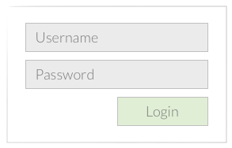
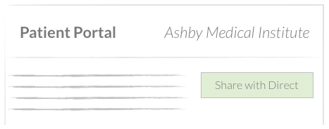
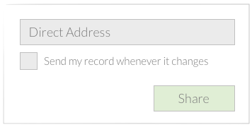

# Transmitting Data Using the Direct Protocol

This section describes the use of the [Direct Project](http://directproject.org) specification to transmit health data securely from a ***data holder*** to a ***third party***.

Examples of data holder systems include: provider's EHR, health insurance claims database, or pharmacy dispensing system. Examples of third parties include: personal health records, mobile applications, or web services.

## Technical

### A. Authentication
A patient's identity must be validated before a transmit can occur. In the case of a patient portal, a patient or their authorized representative is authenticated by logging in using previously-validated credentials. In the case of a live interaction with the patient or their authorized representative, the provider is responsible for "in-person" identity validation.

These requirements are the same identity assurance and authentication requirements sufficient for access to the View and Download portions of View, Download, and Transmit. 

### B. Handling a Patient's Request for Transmit

A patient's request for sharing their data will include:

1. Authorization for transmit
2. Frequency preferences
3. Destination Direct address(es) 

A system must be able to receive these 3 pieces of information from a patient before transmitting their information. These pieces of information may be received via a patient portal or via a provider interface. The patient must also have the ability to revoke a transmit request.

#### 1. Authorization 
Patient access to the patient's health record is a right under HIPAA. However, the provider may reasonably wish to ensure that the patient understands and accepts the resulting action and risks inherent in transmit.

The system should display consent messaging, including all necessary legal language, to the patient or to the provider on the patient's behalf. The user should be able to accept or reject the language. For auditing purposes, that response should be recorded.

See an example of a consent language.

See detailed HIPAA guidance for Blue Button.

#### 2. Frequency

A system must allow the user to set and change at least two options for transmit frequency:

1. Send a single one-time push of health information to the supplied Direct address(es)
2. Continually push health information to the supplied Direct address(es) when the patient record is updated (See [Triggers](#))

Other frequencies are permitted and can be provided by the implementer.

#### 3. Direct Addresses

A system must be able to accept one or more Direct Addresses. A Direct address may look like name@direct.something.com. 

- For field validation, a Direct address follows the form of an email address.
- For certificate validation, all legitimate addresses will have corresponding public certificates discoverable via DNS or LDAP. (See [Certificate Discovery](#))

#### 4. Revoking Transmit Request

Patients may not revoke authorization retrospectively, but must be able to revoke authorization prospectively. There must be a mechanism in the provider interface and patient portal for the user to terminate all future transmissions.

### C. Transmitting Using the Direct Protocol

The Direct Protocol is a specification for how existing standards can be used to securely transport health information over the internet. Direct uses SMTP, S/MIME, and X.509 certificates to achieve security, privacy, data integrity, authentication of sender and receiver, and confirmation of delivery.

As a dataholder, you will need to send patient health information from your system to a Direct address. In order to do that, your system needs to be able to send that payload via SMTP and S/MIME through a Health Information Service Provider (HISP). A HISP is a component that handles Direct message delivery and receipt. The functionality of a HISP can be internal to your system or hosted externally. 

For Blue Button, a HISP must be able to:
- ***Send***: A message and its payload must be sent via SMTP
- ***Use Certificates***: A HISP must [discover certificates via LDAP and DNS](https://docs.google.com/document/d/1igDpIizm7CTfV-fUw_1EnrCUGIljFEgLPRHpgK5iaec/edit)
- ***Encrypt***: Messages will be encrypted using S/MIME
- ***Handle Errors***: Provide [error codes/responses](http://wiki.directproject.org/file/view/Implementation+Guide+for+Delivery+Notification+in+Direct+2012060601.pdf/343915016/Implementation%20Guide%20for%20Delivery%20Notification%20in%20Direct%202012060601.pdf) to the data holder's system

Your system will communicate the payload and destination Direct address to a HISP. It will most likely be via REST or SOAP, but this can differ from system to system.

See [Direct Protocol Documentation](http://wiki.directproject.org/Documentation+Library), [.NET Reference Implementation](http://wiki.directproject.org/CSharp+Reference+Implementation), and [Java Reference Implementation](http://wiki.directproject.org/Java+Reference+Implementation).

### D. Automation and Triggers

When the patient has requested "ongoing" sharing of information, the data holder's system will have to use internal triggers that will cause new information to be sent. How this is done will differ from system to system, but we suggest the following as a starting point:

***Clinical Systems***:
- Discharge or transition to a new care setting (Acute/ER/Inpatient)
- End of encounter (Ambulatory)
- Any time significant new information is received (e.g., new image or lab report)

***Payer Systems***:
- Example 1
- Example 2
- Example 3

Other triggers are permitted and encouraged. It is up to the implementer.

### E. Payload

Each time a transmission happens, the entire content of a patient's record should be sent. It will be up to the receiving party to manage the differences in content between transmissions.

- ***Clinical Content***: [Consolidated CDA w. Meaningful Use Stage 2 Sections and Fields](healthrecords.html)
- ***Payer Content***: TBD

The payload will be zipped and packaged using XDR and XDM.

## Workflow

We have created two sets of storyboards that match the 2 key user flows. The first is within the patient portal and the second is in the provider's interface. These sketches are just examples of how transmitting using Direct could be implemented.

### Patient Portal

***1. Patient logs into the patient portal***

***2. Patient clicks on "Share with Direct"***

***3. Patient reads and accepts transmit terms***

***4. Patient enters Direct address and selects transmit frequency***

***5. Patient has successful transmitted their health record***

### Provider Setting (EMR)

***1. Patient provides consent to a provider***

***2. Provider accesses patient record and adds a Direct address***

***3. Provider adds the Direct address and selects the send frequency.***
