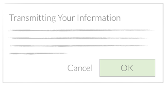
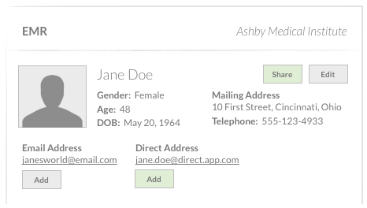
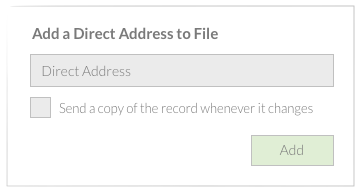
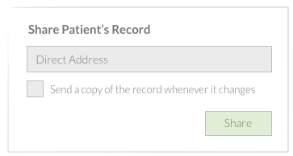

# Transmitting Data Using the Direct Protocol

This section describes the use of the [Direct Project](http://directproject.org) specification to transmit health data securely from a ***data holder*** to a ***third party***.

Examples of data holder systems include: provider's EHR, health insurance claims database, or pharmacy dispensing system. Examples of third parties include: personal health records, mobile applications, or web services.

## 1. Technical

### A. Authentication
A patient's identity must be validated before a transmit can occur. In the case of a patient portal, a patient or their authorized representative is authenticated by logging in using previously-validated credentials. In the case of a live interaction with the patient or their authorized representative, the provider is responsible for "in-person" identity validation.

These requirements are the same identity assurance and authentication requirements sufficient for access to the View and Download portions of View, Download, and Transmit in Meaningful Use Stage 2. 

### B. Handling a Patient's Request for Transmit

A patient's request for sharing their data will include:

1. Authorization for transmit
2. Frequency preferences
3. Destination Direct address(es) 

A system must be able to receive these 3 pieces of information from a patient before transmitting their information. These pieces of information may be received via a patient portal or via a provider interface. The patient must also have the ability to revoke a transmit request.

#### 1. Authorization 
Patient access to the patient's health record is a right under HIPAA. However, the provider may reasonably wish to ensure that the patient understands and accepts the resulting action and risks inherent in transmit.

The system should display consent messaging, including all necessary legal language, to the patient or to the provider on the patient's behalf. The user should be able to accept or reject the language. For auditing purposes, that response should be recorded.

See an example of a consent language.

See detailed HIPAA guidance for Blue Button.

#### 2. Frequency Preferences

A system must allow the user to set and change at least two options for transmit frequency:

1. Send a single one-time push of health information to the supplied Direct address(es)
2. Continually push health information to the supplied Direct address(es) when the patient record is updated (See [Triggers](#triggers))

Other frequencies are permitted and can be provided by the implementer.

#### 3. Direct Addresses

A system must be able to accept one or more Direct Addresses. A Direct address may look like name@direct.something.com. 

- For field validation, a Direct address follows the form of an email address.
- For certificate validation, all legitimate addresses will have corresponding public certificates discoverable via DNS or LDAP. (See [Certificate Discovery](https://docs.google.com/document/d/1igDpIizm7CTfV-fUw_1EnrCUGIljFEgLPRHpgK5iaec/edit))

### C. Revoking Transmit Request

Patients may not revoke authorization retrospectively, but must be able to revoke authorization prospectively. There must be a mechanism in the provider interface and patient portal for the user to terminate all future transmissions.

### D. Transmitting Using the Direct Protocol

The Direct Protocol is a specification for how existing standards can be used to securely transport health information over the internet. Direct uses SMTP, S/MIME, and X.509 certificates to achieve security, privacy, data integrity, authentication of sender and receiver, and confirmation of delivery.

As a dataholder, you will need to send patient health information from your system to a Direct address. In order to do that, your system needs to be able to send that payload via SMTP and S/MIME through a Health Information Service Provider (HISP). A HISP is a component that handles Direct message delivery and receipt. The functionality of a HISP can be internal to your system or hosted externally. 

For Blue Button, a HISP must be able to:
- ***Send***: A message and its payload must be sent via SMTP
- ***Signing a Message***: A message must be signed by a level 1 or better certificate.
- ***Encrypt***: Messages will be encrypted using S/MIME
- ***Use Encryption Certificates***: A HISP must [discover certificates via LDAP and DNS](https://docs.google.com/document/d/1igDpIizm7CTfV-fUw_1EnrCUGIljFEgLPRHpgK5iaec/edit) to encrypt messages
- ***Handle Errors***: Provide [error codes/responses](http://wiki.directproject.org/file/view/Implementation+Guide+for+Delivery+Notification+in+Direct+2012060601.pdf/343915016/Implementation%20Guide%20for%20Delivery%20Notification%20in%20Direct%202012060601.pdf) to the data holder's system

Your system will communicate the payload and destination Direct address to a HISP. It will most likely be via REST or SOAP, but this can differ from system to system.

***Important***: A patient must be able to send their medical information to ***any*** Direct address that they provide. It is sufficient to use the publically discovered certificate via DNS or LDAP to encrypt the message.

See [Direct Protocol Documentation](http://wiki.directproject.org/Documentation+Library), [.NET Reference Implementation](http://wiki.directproject.org/CSharp+Reference+Implementation), and [Java Reference Implementation](http://wiki.directproject.org/Java+Reference+Implementation).

***Workgroup Discussion***: The team and workgroup are actively discussing how certificate discovery can be done in a way that enables a provider to send a CCDA to any Direct address that a patient provides. The current proposal on the table uses the certificate discovered via DNS and LDAP to encrypt the message. There is an issue with this approach when the certificate is self-signed. There is a risk if DNS spoofing or a man in the middle attack happens. We are gauging the level/impact of this risk. One solution that has been recently proposed is to require third parties to have a Level 1 certificate from an SSL authority like Verisign/Comodo/Geotrust.

### E. Automation and Triggers {#triggers}

When the patient has requested "ongoing" sharing of information, the data holder's system will have to use internal triggers that will cause new information to be sent. How this is done will differ from system to system, but we suggest the following as a starting point:

***Clinical Systems***:
- Discharge or transition to a new care setting (Acute/ER/Inpatient)
- End of encounter (Ambulatory)
- Any time significant new information is received (e.g., new image or lab report)

***Payer Systems***:
- New adjudicated claims data is available
- New explanation of benefits is available

Other triggers are permitted and encouraged. It is up to the implementer. Systems that are unable to implement triggers should investigate transmitting records at predetermined time intervals.

### F. Payload

When a transmission occurs, the following should be part of the payload as a multi-part MIME:
1. Clinical Summary
2. Additional Documents
3. Transmit Context

#### 1. Clinical Summary
The primary content of the transmission will be the [***Clinical Summary***](healthrecords.html), which is the entire patient's health history.

The content format shall use the [Consolidated CDA w. Meaningful Use Stage 2 Sections and Fields](healthrecords.html) and have a MIME type of application/xml+ccda.

#### 2. Additional Documents
Depending on the trigger or type of encounter, it may also be appropriate to include one of the following:
- ***Transition of Care / Referral Summary***
- ***Ambulatory Summary***
- ***Inpatient Summary***

The payload may include other documents as well.

#### 3. Transmit Context
The message body should also include attribution that this transmission was on behalf of the patient in text/plain or text/html:


This message was sent by [Provider Name] at the request of [Patient Name].


***Workgroup Discussion***: The Content and Push workgroups are discussing how the payload should be structured. The choice is between XDR/XDM vs. multi-part MIME. They are also deciding how the transmit context text should be constructed.

<!--
## 2. Workflow

We have created two sets of storyboards that match the 2 key user flows. The first is within the patient portal and the second is in the provider's interface. These sketches are just examples of how transmitting using Direct could be implemented.

### A. Patient Portal

In this first flow, a patient uses the patient portal to send his/her record to a Direct address. This flow assumes a patient knows how to interact with the patient portal.

***1. Patient logs into the patient portal***

***2. Patient clicks on "Share with Direct"***

***3. Patient reads and accepts transmit terms***

***4. Patient enters Direct address and selects transmit frequency***

After clicking ***Share*** the patient will have successfully transmitted his/her record.

### B. Provider Setting (EMR)

In this second flow, we describe how a patient can ask their provider to setup the transmission of his/her record. This assumes that the provider has received authorization and instructions from the patient.

***1. Provider accesses patient record***

In the sketch above, we present a Direct address much like we would an Email address. There's a section for ***Direct Address*** and a button to add more. This action associates a Direct address with a patient's record (See 2A).  There's also a ***Share*** button on the top right to facilitate a one-time share (See 2B).

***2A. Provider adds the Direct address and selects the send frequency.***

Clicking on ***Add*** under ***Direct Address*** will show this screen:

***2B. Provider adds the Direct address and selects the send frequency.***

Clicking on ***Share*** on the top right will show this screen:

-->